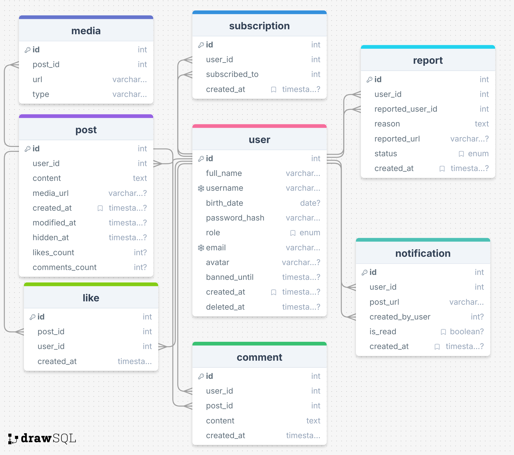
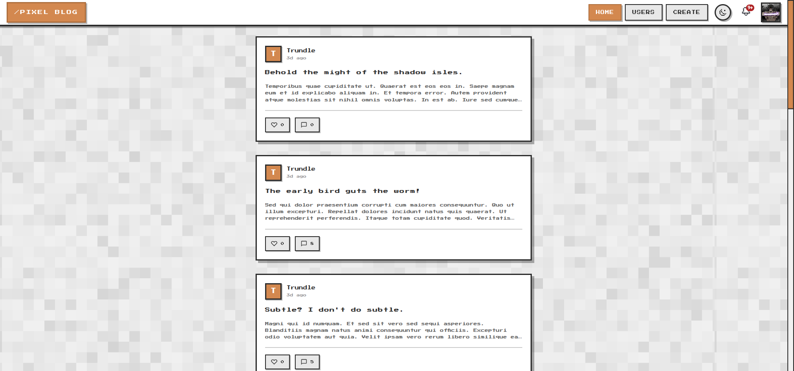
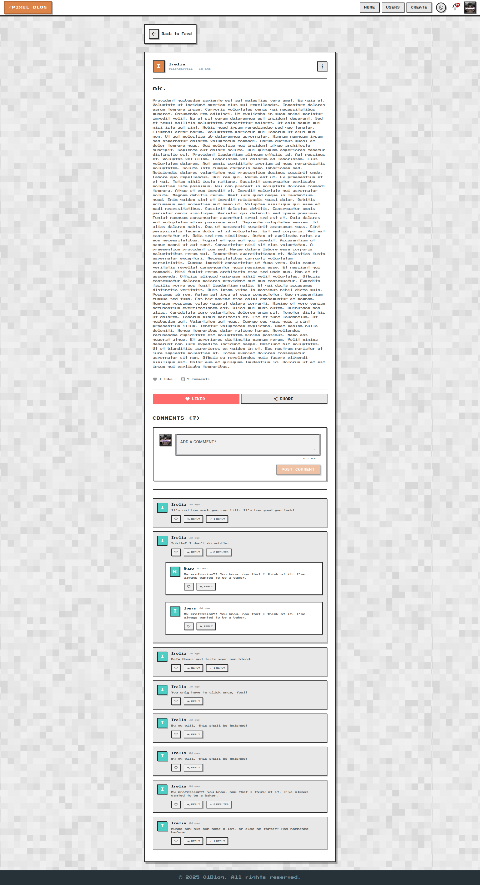
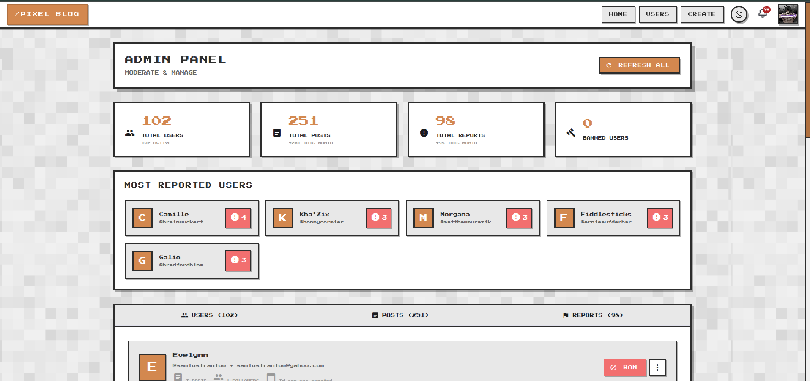
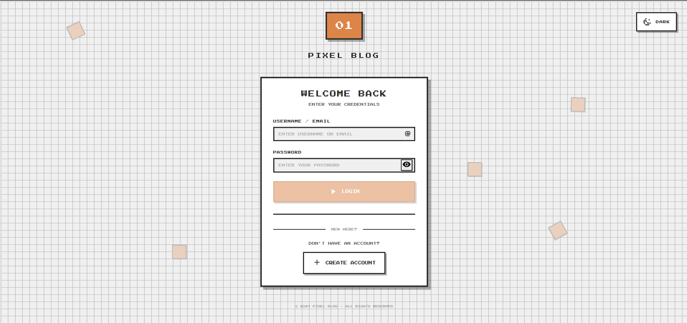

# 01blog

01blog is a full-stack blog application with a Spring Boot backend, an Angular frontend, and a PostgreSQL database. The repository contains Docker and VS Code task configurations to make development and local deployment easier.

**Features**
- REST API backend with Spring Boot
- Angular  frontend with client-side routing and service integration
- PostgreSQL database (Docker)
- JWT-based authentication
- Image upload and Cloudinary integration

**Repository Structure**
- `backend/` — Spring Boot application (Java, Maven)
- `blog-frontend/` — Angular frontend
- `database/` — database Docker compose files and helpers
- `docker-compose.yaml` — top-level compose for local environment orchestration
- `assets/` — project assets (e.g., DB schema image)

**Prerequisites**
- Java 17+ (or the JDK version required by the project)
- Node.js + npm
- Angular CLI (for development): `npm i -g @angular/cli` 
- Docker & Docker Compose (for running the DB and/or full stack)

**Environment / Configuration**
The backend reads configuration from environment variables (see `backend/src/main/resources/application.properties`). Important variables:

- `DATABASE_URL` — JDBC URL for PostgreSQL (e.g. `jdbc:postgresql://postgres:5432/01DB`)
- `DATABASE_USERNAME` — DB username
- `DATABASE_PASSWORD` — DB password
- `JWT_SECRET_KEY` — secret used to sign JSON Web Tokens (do NOT commit real secrets into source control)
- `CLOUDINARY_URL` — Cloudinary connection string for image uploads (optional)

Set these variables in your shell, a `.env` file used by `docker-compose`, or in your process manager before starting the backend.

**Running Locally (recommended)**
1. Start the database using Docker Compose (from `database/`):

```bash
cd database
docker-compose up -d
```

2. Start the backend (using the wrapper):

```bash
cd backend
./mvnw spring-boot:run
```

3. Start the frontend:

```bash
cd blog-frontend
npm install
ng serve
```

You can also run the workspace VS Code tasks: `Start All` will start Database, Backend and Frontend in parallel (see `.vscode/tasks.json` or the task list in the project workspace tasks).

**Running with Docker (full stack)**
If a top-level `docker-compose.yaml` is provided and configured, you can run the entire stack:

```bash
docker-compose up --build
```

Adjust environment variables in the compose file or via an external `.env` file.

**Development Notes**
- Backend logs and configuration: `backend/src/main/resources/application.properties`.
- JWT secret is expected in `JWT_SECRET_KEY`; make sure it's set in your environment before starting the backend.
- Uploaded images are stored in the `images` directory by default. When using Cloudinary, uploads will be proxied to Cloudinary if `CLOUDINARY_URL` is set.
- Database migrations are handled via JPA/Hibernate with `spring.jpa.hibernate.ddl-auto=update` (suitable for development only).

**Troubleshooting**
- If the backend fails to connect to the database, confirm `DATABASE_URL`, `DATABASE_USERNAME`, and `DATABASE_PASSWORD` are correct and the DB container is reachable from the backend.
- If file uploads fail, check `spring.servlet.multipart.max-file-size` and ensure the `images` directory is writable by the backend process.

**Screenshots**

| Feature | Description |
|---------|-------------|
| **Database Schema** |  |
| **Blog Home** |  |
| **Post Detail** |  |
| **Admin Dashboard** |   |
| **Authentication** |   |

To add more screenshots:
1. Run the application locally (`docker-compose up` or the individual services)
2. Navigate to `http://localhost:4200` for the frontend and `http://localhost:8080` for the API
3. Take screenshots of key features and save them to `assets/screenshots/`
4. Update this section with descriptions and image paths


